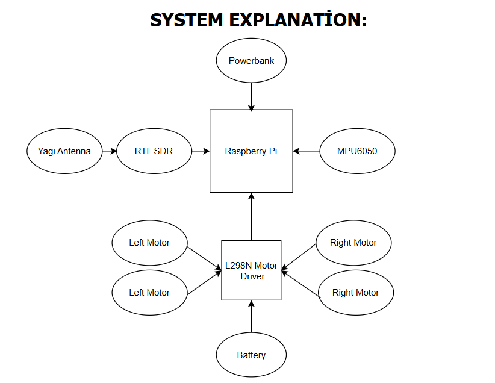
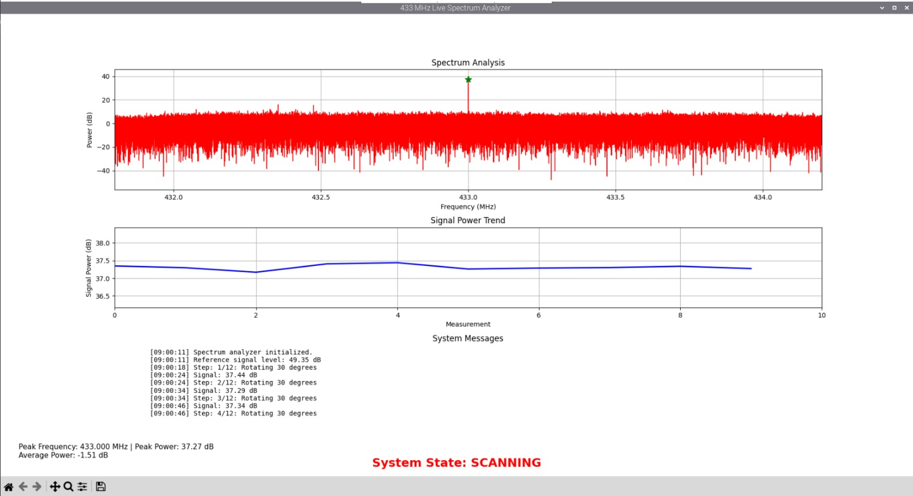
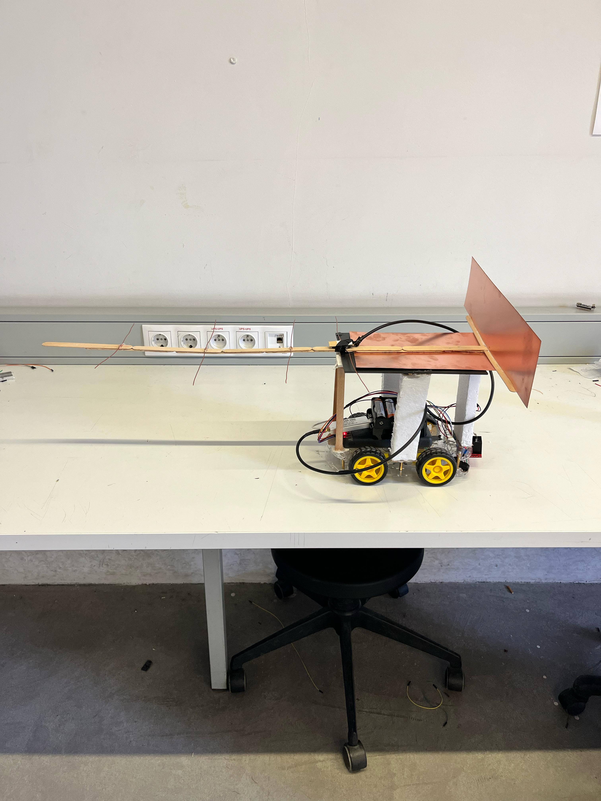
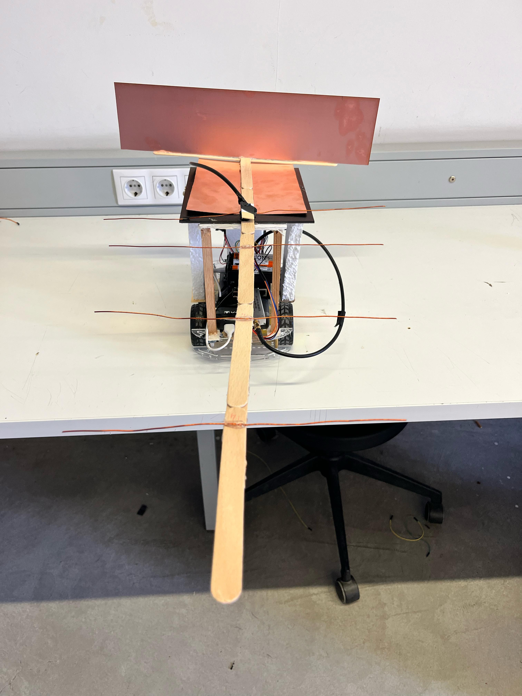

# TOBB ETÜ ELE495 - Capstone Project

# Table of Contents
- [Introduction](#introduction)
- [Features](#features)
- [Installation](#installation)
- [Usage](#usage)
- [Screenshots](#screenshots)
- [Acknowledgements](#acknowledgements)

## Introduction
In the Spring semester of the 2024–2025 academic year at TOBB University of Economics and Technology, students have been assigned a senior design project titled "An Autonomous Vehicle Navigating Toward an RF Signal."

The objective of this project is to develop a fully autonomous ground vehicle capable of detecting and following a 433 MHz RF signal emitted by a stationary transmitter. The system will be controlled by a Raspberry Pi 4 and will autonomously determine the direction of signal propagation to navigate toward the source.

Once the vehicle enters a predefined radius around the transmitter, it will halt movement. To ensure full autonomy, no manual control or intervention will be allowed after the initial signal transmission. Additionally, as the vehicle approaches the target zone, its real-time positional data will be transmitted to the user via a dedicated web-based interface.

The primary goal is for the vehicle to successfully reach the designated radius within a given time frame, demonstrating efficient signal tracking, mobility, and autonomous decision-making.

## Features
List the key features and functionalities of the project.
- Hardware: Raspberry pi 4
- Raspberry Pi OS (Linux)
- RTL SDR 
-  Features of main components:  
  - Motors and casters: for movement  
  - MPU6050: The vehicle performs rotations in predefined angular increments  
  - L298N Motor driver: To enable precise control of the motors integrated into the vehicle platform  
  - Powerbank and 18650 rechargeable battery: To provide power to all onboard components  
  - microSD: Memory of the Raspberry Pi 4  
  - Yagi antenna: To capture the signal with directional sensitivity  

## Installation
Libraries used in the project:

- **GPIO**: For the input and output connections of the motor pins  
- **rtlsdr**: Configuration of RTL SDR  
- **numpy**: For mathematical operations  
- **SMBus**: Configuration of the MPU6050 gyro module  
- **matplotlib**: Draw the spectrum  
- **tkinter**: For GUI interface  
- **threading**: For communication between interface elements

Raspberry:
A 32 GB microSD card is used to provide storage for the Raspberry Pi [Rapberry Pi](https://www.raspberrypi.com/software/)

## Usage
The system allows an autonomous vehicle to detect and follow a 433 MHz RF signal using an RTL-SDR and a gyroscope-based motion system. Follow the steps below to run the program:

1-Ensure hardware connections are properly set:
  Raspberry Pi 4
  RTL-SDR USB dongle
  MPU6050 gyroscope sensor
  Motor driver (connected to GPIO pins)

2-Insert a 32 GB microSD card with the Raspberry Pi OS installed.

3-Upload the project files to the Raspberry Pi, including:
  The Python main script (jiroskop.py or equivalent)
  Any additional dependencies

4-Install required libraries if not already installed:
  pip install numpy matplotlib rtlsdr smbus2 RPi.GPIO

5-Run the main Python script:
  python3 jiroskop.py

6-Use the GUI application that appears on your screen:
  Click START to begin directional signal scanning
  The vehicle will rotate in steps of 30°, analyze signal strength, and move toward the strongest signal
  If the received signal reaches the predefined threshold, the vehicle will stop automatically

7-Real-time spectrum analysis and system messages will be displayed using matplotlib.

8-Click the STOP button to terminate the operation manually. If the threshold value is reached before clicking the STOP button, the vehicle will stop automatically.

## Screenshots
Some images from project:

Direction Finding Examples:

[Example Demo](https://www.youtube.com/watch?v=5TyTXgLMcv0)

## Acknowledgements

Here are the contributors and our resources.

Contributors:

- [Osman Tunç](https://github.com/osmantunc)
- [Cenk Yaşın](https://github.com/cnkysn)
- [Emir Atasayar](https://github.com/emiratasayar)
- [Fethi Engin Uzhan](https://github.com/FethiEnginUzhan)
- [Rasih Görkem Şimşek](https://github.com/rsimsek3)

